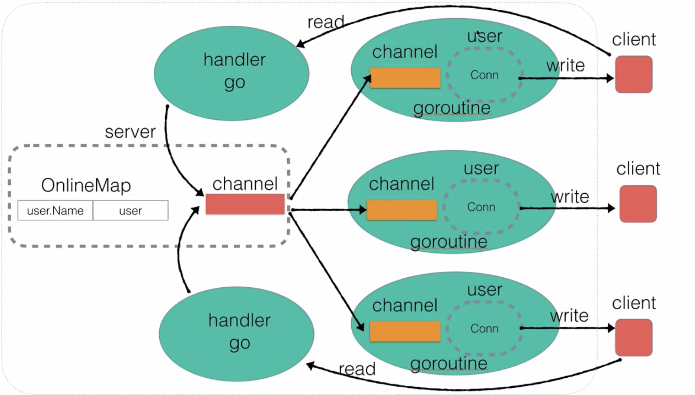

# IM-System

# 基于 Golang 的简单即时通讯系统
## 功能版本更新
### v1.0 用户上线以及整体广播功能上线
### v2.0 用户发送广播消息功能
### v3.0 连续聊天
### v4.0 用户业务层封装
### v5.0 用户查询当前的在线用户
### v6.0 支持修改用户名
### v7.0 超时强踢
#### v7.1 超时强踢服务器关闭 bug 修复
#### v7.2 超时强踢持续访问 channel bug 修复
### v8.0 用户私聊功能
### v9.0 客户端功能 + 命令行传参解析
#### v9.1 客户端菜单显示

## 知识点
```
    流程梳理
	1. server 启动后持续监听上线的用户和消息管道
	2. 当我命令行 nc 后，此时代表一个用户上线，在 server 中监听到用户上线后，在全局用户表中注册该用户
	3. 在注册该用户后，server 服务器因为要将消息全局广播给所有的客户端，所以需要先将该上线用户的消息 push 到 chan 中
	4. chan 中得到用户上线的消息后，此时，this.ListenMessage() 会停止阻塞，将消息送到每个在线用户的 chan 中
	5. 每个在线用户的 chan 得到消息后，user.ListenMessage() 会停止阻塞，将收到的消息传到显示在客户端（conn.Write([]byte(msg + "\n"))）
```

```
	goroutine关键点
	1. 要记住，goroutine 完成当前函数后会自动结束，如果要保持当前 goroutine，必须保证调用 goroutine 的进程不结束
	所以，在上面的代码中，用户连续聊天的 dohandler 中添加了 select{}，以保证 dohandler 的这个 goroutine 不结束
	（select{}保证每个用户与服务器的连接不断开），这个 goroutine 不结束，则会保证 select{} 上面的那个用户发送广播消
	息的 goroutine 不退出，则会保证其中的 for 循环持续轮询，从而达到用户连续聊天的目的。
	总结：要想一个 goroutine 不结束，要保证调用 goroutine 的函数体不结束。
```

```
	buffer := make([]byte, 4096)
	/*	
		当 buffer 为 0 时，conn.Read()会阻塞，而不会返回 n = 0
		在典型的 TCP 连接中，n == 0 只会在以下情况出现：
		1. 对方主动关闭了连接（例如客户端调用 conn.Close()）。
		2. 发生了某些异常导致连接被强制关闭。
	*/

```

```
	func (this *Client) Run() {
		for this.flag != 0{
			for this.menu() != true {
			
			}

			switch this.flag {
			case 1:
				fmt.Println("选择公聊模式")
				break
			case 2:
				fmt.Println("选择私聊模式")
				break
			case 3:
				fmt.Println("选择更改用户名")
				break
			case 0:
				fmt.Println("退出系统")
				break
			}
		}
		/*
			这里 select 执行的逻辑是，如果我 client 输入一直是不合法的，则会一直在最外侧循环；
			如果合法则会进入内层 menu 循环，直到输入模式为合法范围。此时输入 123 都是正常处理业务，
			而输入 0 则会导致this.flag变为 0，此时外层循环直接退出
		*/
	}
```